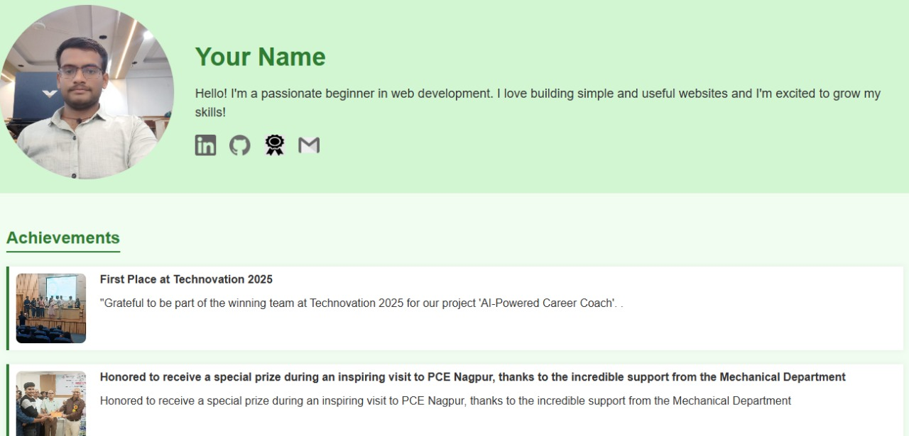

# My Personal Portfolio Website

This is a simple personal portfolio website created using pure HTML and CSS. It showcases my profile, achievements, and projects. The design is simple, clean, and beginner-friendly.

# 🔗 Live Preview

You can open the index.html file in your browser to see the portfolio.

---

# 🌟 Features

Profile Section with photo, brief intro, and social media links.

Achievements Section showcasing awards and recognitions.

Portfolio Section displaying personal projects with images and brief descriptions.

Simple, responsive layout with clean design.

Easy to customize and extend.

---

# 🔧 Technologies Used

HTML5

CSS3

No external libraries or frameworks used.

---

# 🚀 How to Use

1. Clone or download the repository.

2. Replace index.html with your own information:

Change your name, intro, profile picture.

Update your LinkedIn, GitHub, and other social links.

Replace achievement and project images and descriptions.

3. Open index.html in your browser to view your personal portfolio.

4. Optionally, you can host it on GitHub Pages, Netlify, or any other free hosting service.

---

